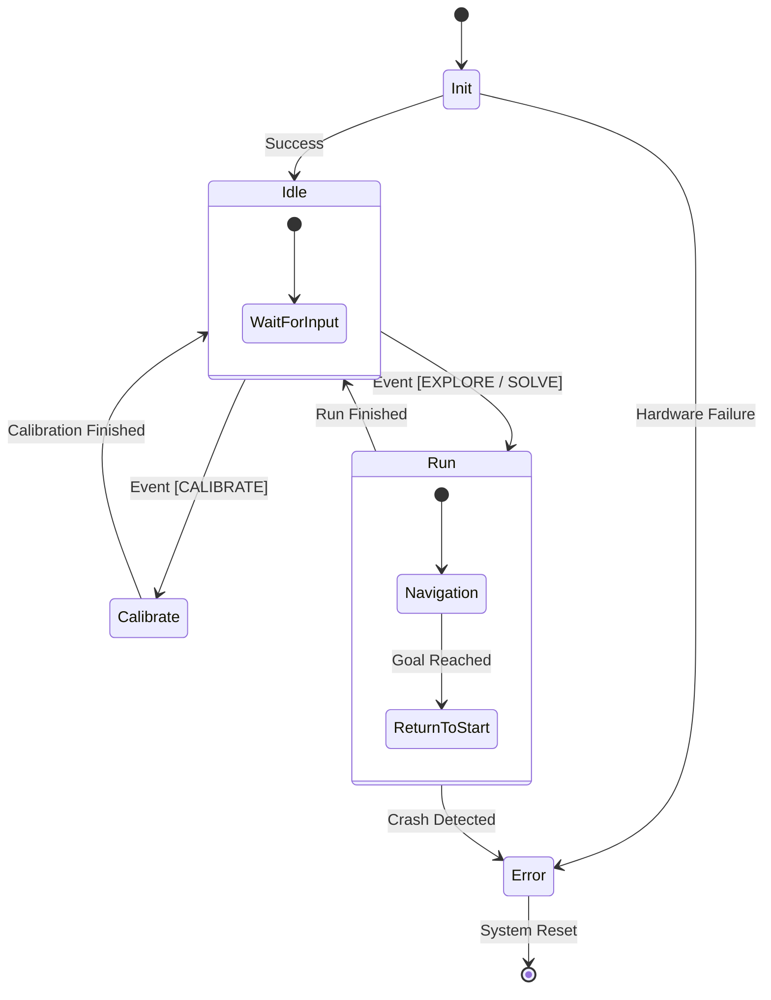

# 4. Software Architecture

The software development of the Micras robot underwent a significant structural transformation to meet the reliability and scalability requirements of high-performance Micromouse competitions. The primary objective of this refactoring was to transition from a monolithic, procedural control loop to a modular, event-driven architecture.

This section details the high-level architectural design, focusing on the decision-making core (Finite State Machine) and the Human-Machine Interface (HMI) abstraction.

## 4.1. Architectural Paradigm Shift

In previous iterations, the robot's behavior was governed by a centralized "Super Loop" controller. While simple to implement initially, this approach coupled low-level hardware management (e.g., reading raw sensor values) directly with high-level logic (e.g., deciding whether to explore or solve). As the complexity of the navigation algorithms increased, this coupling resulted in a rigid system where adding new features risk destabilizing existing functionality.

The new architecture adopts an Object-Oriented design, specifically utilizing the **State Pattern**. This approach separates the robot's logic into distinct, self-contained modules. The central execution flow is no longer a series of conditional checks but a delegation of authority to the currently active "State" object. This decoupling ensures that the navigation logic does not need to know the specifics of the hardware implementation, and conversely, the hardware drivers operate independently of the current mission objective.

## 4.2. Finite State Machine (FSM)

At the core of the new system is a custom Finite State Machine (FSM). The FSM models the robot's lifecycle as a set of discrete states, where the robot can only exist in one state at a time. This model aligns perfectly with the Micromouse competition flow, which consists of distinct phases: calibration, configuration, exploration, and fast runs.

### 4.2.1. State definitions

The behavior is compartmentalized into the following primary states:

*   **Initialization (Init):** The system performs hardware self-checks (IMU connectivity, sensor functionality) and initializes the communication peripherals.
*   **Idle:** The default resting state. Here, the robot awaits user input. All motors are disabled, and the system consumes minimal power while polling the Interface layer for configuration commands.
*   **Calibration:** A specialized state for sensor tuning. It isolates the logic required to normalize wall sensor readings and gyroscope offsets, ensuring these critical values are not affected by other running processes.
*   **Run:** The active state where navigation algorithms take control. This state encapsulates both "Exploration" (mapping the maze) and "Solving" (executing the fastest path).
*   **Error:** A safety trap state. If a critical hardware failure or a software exception (e.g., crash detection) occurs, the system locks into this state to prevent hardware damage, signaling the error via the HMI.

### 4.2.2. State Transitions and Flow

Transitions between these states are deterministic and triggered by specific events processed by the FSM. The diagram below illustrates the high-level flow of the system:



By encapsulating the logic within these states, the system achieves a high degree of **testability**. For instance, the "Run" state can be unit-tested with a simulated maze environment without needing to instantiate the hardware drivers required for the "Calibration" state.

## 4.3. Human-Machine Interface (HMI) Abstraction

A critical aspect of a competition robot is the efficiency of the interaction between the operator and the machine. During a competition, the operator must quickly configure the robot's strategy (e.g., switching from "Safe Exploration" to "Risky Speed Run") using limited physical inputs.

To manage this, the firmware introduces a dedicated **Interface** abstraction layer. This module acts as a bridge between the physical world (Switch, Buttons, LEDs) and the logical world (Events, Objectives).

### 4.3.1. Event-Driven Configuration

The Interface class aggregates the status of various hardware components and translates them into semantic **Events**. This abstraction relies on the underlying Proxy layer to handle low-level signal processing, such as button debouncing and sensor filtering. The Interface layer's primary responsibility is to map these pre-processed hardware conditions to high-level triggers.

The system maps inputs to events as follows:

*   **Condition Check:** The Interface evaluates specific conditions defined by the hardware state (e.g., "Is the button in a 'Short Press' state?" or "Has a specific DIP switch been toggled?").
*   **Event Generation:** If a condition is met, a semantic event is dispatched (e.g., `Event::EXPLORE`, `Event::SOLVE`). This allows the core logic to subscribe to "What happened" (User wants to Explore) rather than "How it happened" (Button Pin 3 went high).

### 4.3.2. Configuration Robustness

This layer also manages the robot's configuration profile via DIP switches. Before a run, the Interface reads the state of the switches to determine:
1.  **Strategy:** Whether to prioritize diagonal paths or orthogonal-only movement.
2.  **Performance:** Whether to enable the vacuum fan for increased traction.
3.  **Risk Profile:** Whether to execute a "Risky" run (higher speeds, lower safety margins) or a "Conservative" run.

By abstracting these inputs, the architecture allows for **Virtual Control**. Since the FSM listens for standardized Events, the `micras_comm` telemetry module can inject these same events remotely via Bluetooth. This means the robot can be configured and started wirelessly from a computer using the exact same logic path as the physical buttons, significantly simplifying the debugging and testing process.

# 5. Navigation and Control System

The `micras_nav` module constitutes the logical core of the Micras robot, responsible for the end-to-end process of perceiving the environment, planning trajectories, and executing motor commands. The refactoring of this module represents the most significant engineering advancement in the new firmware, transitioning from a reactive, position-based approach to a predictive, velocity-centric architecture.

This section details the design of the navigation stack, the algorithms employed for path planning, and the control theories applied to high-speed motion.

## 5.1. Architectural Components

The navigation stack is composed of eight specialized components that interact to form a closed-loop system:

1.  **State & Pose (`state.hpp`):** Defines the robot's kinematic state, encompassing `Pose` (continuous position and orientation) and `Twist` (linear and angular velocities).
2.  **GridPose (`grid_pose.hpp`):** Bridges the robot's continuous physical state with the discrete, cell-based maze representation, handling cell coordinates and cardinal directions.
3.  **Odometry (`odometry.hpp`):** Estimates the robot's position and velocity using a sensor fusion approach.
4.  **Maze & Costmap (`maze.hpp`, `costmap.hpp`):** Implements the Simultaneous Localization and Mapping (SLAM) and pathfinding algorithms.
5.  **ActionQueuer (`action_queuer.hpp`):** The tactical planner responsible for converting high-level path objectives into a sequence of executable, atomic actions.
6.  **Actions (`move.hpp`, `turn.hpp`):** Polymorphic classes defining precise kinematic profiles for individual movement segments.
7.  **SpeedController (`speed_controller.hpp`):** The low-level execution layer, implementing advanced feed-forward and feedback (PID) control for motor commands.
8.  **FollowWall (`follow_wall.hpp`):** Provides real-time lateral and angular corrections based on wall sensor data to maintain trajectory.

## 5.2. Perception and Localization

### 5.2.1. Sensor Fusion Odometry

The `Odometry` class estimates the robot's current `State` by integrating data from multiple sensors. It employs a classic Differential Drive kinematic model, enhanced by inertial data.
*   **Rotary Encoders:** Provide high-resolution measurements of wheel rotations ($\Delta d_L, \Delta d_R$), from which linear velocity and displacement are derived.
*   **Inertial Measurement Unit (IMU):** Specifically, the gyroscope provides accurate angular velocity ($\omega_{gyro}$), crucial for robust orientation estimation, especially during wheel slip where encoder-derived angular velocity would be unreliable.
*   **Signal Processing:** Raw sensor readings, particularly velocities, can be noisy. To counteract this, a **Butterworth Filter** is applied to the input streams. This digital filter smooths the velocity profiles before integration, preventing noise amplification and ensuring cleaner data for the control system's derivative calculations.

### 5.2.2. Global vs. Local Odometry Strategy

A fundamental challenge in mobile robotics is the accumulation of odometry error. The legacy firmware's reliance on **Global Odometry**, tracking $(x, y)$ from the start, led to significant drift over time. The new architecture adopts a **Local, Action-Based Odometry** strategy.
*   **Problem Statement:** Global odometry errors (due to wheel slip, uneven surfaces) are unbounded and accumulate continuously, leading to increasing position uncertainty.
*   **Solution: Action-Based Resetting:** The robot effectively "resets" its relative coordinate frame at the start of each atomic action (e.g., entering a new cell).
    *   During movement, the `FollowWall` module actively uses IR distance sensors to measure and correct the robot's lateral offset from the maze walls.
    *   **Post Detection:** A key feature is the detection of "posts" (the edges of walls at cell intersections). By monitoring the derivative of the wall sensor readings, the robot precisely identifies these physical landmarks. This triggers a longitudinal correction, physically "snapping" the robot's estimated position to the known grid, thereby bounding the error.
*   **Benefit:** While a global estimate is maintained for mapping, all movement commands are calculated relative to the robot's most recently corrected position. This significantly improves localization accuracy over long runs by preventing error accumulation.

## 5.3. Mapping and Planning Algorithms

The robot's navigation intelligence resides within the `Maze` and `Costmap` components, which implement sophisticated algorithms for Simultaneous Localization and Mapping (SLAM) and pathfinding.

### 5.3.1. The Costmap (BFS Flood Fill)

The `Costmap` is the robot's internal representation of the maze, a $16 \times 16$ grid. Each cell stores critical information:
*   **Wall State:** For each of its four directions, a cell stores `UNKNOWN`, `NO_WALL`, `WALL`, or `VIRTUAL`.
*   **Cost Layers:** Multiple cost layers (e.g., `EXPLORE` layer for distance to target, `RETURN` layer for distance to start) are maintained.
*   **Algorithm (Breadth-First Search - BFS Flood Fill):**
    1.  **Initialization:** The target cell(s) (e.g., the maze center for exploration, the start cell for returning) are assigned a cost of 0.
    2.  **Wave Propagation:** A BFS algorithm systematically propagates costs outwards. For any given cell, its accessible neighbors (not blocked by walls) are assigned a cost of $Cost_{current} + 1$. This process ensures that every cell's value represents the minimum number of steps (or "Manhattan distance") to the target.
    3.  **Dynamic Recompute:** When new wall information is received from sensors (`update_walls`), the `Costmap` can trigger a local recomputation. This efficient update ensures that the pathfinding gradient is always accurate and responsive to new discoveries or changes in the maze.

### 5.3.2. Exploration Strategy (BFS Frontier Search and Gradient Descent)

During the **Exploration** phase, the robot systematically discovers the maze structure.
*   **Decision-Making:** The `get_next_goal` method utilizes a combination of a BFS-based frontier search and gradient descent on the Flood Fill costmap.
*   **Nearest Frontier:** When the robot needs to find a new area to explore, the `get_next_bfs_goal` function performs a BFS to locate the nearest accessible cell that is "unvisited" (contains `UNKNOWN` walls) and falls within a calculated cost threshold. This guides the robot towards unknown territory efficiently.
*   **Gradient Following:** Once a temporary target (a frontier or the overall goal) is identified, the robot primarily navigates by following the steepest descent on the Flood Fill costmap. This means it always moves to the accessible neighboring cell with the lowest cost, effectively following the shortest known path towards its current objective.
*   **Virtual Walls:** If the robot encounters a dead-end (a cell with three walls, meaning only one entrance/exit), it dynamically adds a `VIRTUAL` wall at the entrance. This "pessimistic" update immediately signals the Flood Fill algorithm to reroute, preventing the robot from repeatedly entering dead-ends.

### 5.3.3. Optimal Route Calculation (Depth-First Search with Backtracking)

After the maze has been fully explored and mapped, the robot calculates the absolute fastest path for the **Solve** run.
*   **Algorithm:** The `compute_best_route` method employs a **Depth-First Search (DFS) with Recursive Backtracking**.
*   **Motivation:** While Dijkstra's or A* algorithms could find the geometrically shortest path, they do not account for the robot's motion dynamics (acceleration, deceleration, turning profiles). The DFS-based approach enables time-optimal route selection.
*   **Core Logic:**
    1.  **Initialization:** The algorithm starts at the `GridPoint` origin and recursively explores all possible neighboring cells that:
        - Have not been visited in the current path (prevent cycles).
        - Are accessible (no wall blocking the path).
        - Have been discovered during exploration (contain wall information).
    2.  **Recursive Exploration:** From each cell, the algorithm recursively attempts to visit all valid neighbors, maintaining a `visited` set to prevent revisiting nodes within a single path.
    3.  **Goal Detection:** When the algorithm reaches a cell within the goal set (e.g., the maze center), it:
        - Computes the *total traversal time* for the entire route discovered so far using `get_route_time()`. This simulation accounts for the precise kinematic profiles (trapezoidal acceleration, turn radii, diagonal paths).
        - Compares this time against the globally best route found. If it is faster, it updates `best_route` and `best_time`.
    4.  **Backtracking with Pruning:** The algorithm backtracks when:
        - A goal has been reached and the path is evaluated.
        - A path is identified as suboptimal via the **pruning heuristic**: If `route_size_so_far + manhattan_distance_to_goal ≥ cost_margin × best_route_size`, the branch is abandoned, as it cannot possibly yield a better solution.
    5.  **Final Selection:** After all feasible paths have been explored, the `best_route` is returned.
*   **Pruning Strategy:** The heuristic uses Manhattan distance (a lower bound on true distance) to eliminate branches. The `cost_margin` parameter allows tuning aggressiveness: a larger margin prunes more aggressively (faster but potentially misses optimal routes), while a smaller margin explores more thoroughly.
*   **Optimization Result:** This method yields a route that minimizes *actual traversal time*, not just cell count, by preferring long straightaways and smooth turns over shorter geometric paths.

## 5.4. Motion Planning: The Action Queue

The `ActionQueuer` (`action_queuer.hpp`) is the tactical layer that translates high-level pathfinding decisions (sequences of `GridPoint`s) into a series of executable, atomic motor commands (`MoveAction`, `TurnAction`). This component enables **Predictive Navigation**, allowing the robot to prepare for future movements before the current one is complete.

### 5.4.1. Action Types and Decomposition

The `ActionQueuer` decomposes maze navigation into six fundamental action types:

*   **START:** Alignment action, smoothly transitions the robot from standstill to initial motion.
*   **MOVE_FORWARD:** Linear translation with trapezoidal velocity profile.
*   **TURN:** Rotation following a mathematically computed curve with specific radius.
*   **SPIN:** In-place rotation (zero linear velocity).
*   **DIAGONAL:** 45-degree diagonal movement (optimization for smoother paths).
*   **STOP:** Deceleration to a complete halt.

### 5.4.2. Two-Phase Action Generation

The `ActionQueuer` uses two distinct modes, each optimized for its context:

**Exploration Mode (`push_exploring`):**
*   During exploration, the action queue is populated dynamically, typically holding only 1-2 steps ahead.
*   When the queue is nearly empty, the `Maze` logic is invoked to determine the next immediate objective.
*   This dynamic population ensures continuous motion even when the full maze is unknown.
*   Actions use **conservative dynamics** (lower accelerations) to ensure robustness with incomplete map knowledge.
*   The `follow_wall` correction is **enabled** on straight segments, allowing reactive adjustments to wall positions.

**Solve Mode (`recompute`):**
*   Once the optimal route is computed, the entire sequence of `GridPoint`s is pre-compiled into an optimized action queue.
*   **Consecutive Movement Merging:** Multiple "move forward one cell" actions are consolidated into single, longer movements. For example, three consecutive cells in a straight line become one `MoveAction` covering 1.62 meters, allowing the robot to accelerate to and maintain maximum velocity across multiple cells.
*   **Diagonal Path Optimization:** The action queuer identifies "staircase" patterns in the path (alternating horizontal and vertical moves) and converts them into true 45-degree `DIAGONAL` actions. These offer a path length reduction by a factor of $\sqrt{2}$ and enable smoother velocity transitions.
*   **Curve Smoothing:** Transitions between movements are optimized using mathematically computed curve radii, allowing the robot to maintain near-constant velocity through turns rather than decelerating and re-accelerating.
*   Actions use **aggressive dynamics** (maximum acceleration, higher speeds) to minimize total traversal time.
*   The `follow_wall` correction is **disabled**, allowing the robot to commit fully to the pre-planned trajectory.

### 5.4.3. Optimization Pipeline

The action generation follows a multi-stage optimization pipeline:

**Stage 1: Primitive Action Generation (`get_action`)**

The raw grid path is converted into a sequence of primitive actions. For each pair of consecutive grid cells, the queuer determines the required action:

*   **Same direction (move forward):** Produces a `MOVE_FORWARD` action with distance equal to the cell size.
*   **90-degree left/right turn:** Produces a `TURN` action with angle $\pm\pi/2$.
*   **180-degree reversal:** Produces a `SPIN` action (turn in place).

**Stage 2: Diagonal Injection (`add_diagonals`)**

The algorithm scans for "L-shaped" movement patterns (a turn followed by a perpendicular move in the original direction). When detected, these are replaced with a single `DIAGONAL` action at 45 degrees.

*Example:* A path `[MOVE forward, TURN left 90°, MOVE forward]` becomes `[TURN 45° left-forward, DIAGONAL, MOVE forward]`. The diagonal covers $\sqrt{2}$ times the cell distance in the same time as two orthogonal moves, yielding a net time saving of approximately 7%.

**Stage 3: Action Consolidation (`join_actions`)**

Consecutive actions of the same type are merged. Multiple `MOVE_FORWARD` actions are summed into a single action with combined distance. This reduces overhead and allows the controller to sustain higher velocities.

*Example:* `[MOVE 0.54m, MOVE 0.54m, MOVE 0.54m]` becomes `[MOVE 1.62m]`.

**Stage 4: Curve Trimming and Smoothing**

For transitions involving rotations, the `ActionQueuer` applies a sophisticated trimming algorithm:

1.  **Curve Radius Calculation:** For each turn angle (45°, 90°, 135°, 180°), the queuer pre-computes the optimal curve radius that keeps the robot within safe distance bounds from walls:
    $$r_{\theta} = \frac{\text{cell\_size} - 2 \times \text{safety\_margin}}{2(\sin(\theta/2))^{-1} - 2}$$
    This ensures the robot's actual trajectory stays within the maze without colliding.

2.  **Velocity Profile Coordination:** For each curve, the maximum sustainable linear and angular velocities are calculated, accounting for centripetal acceleration limits:
    $$v_{linear}^{max} = \sqrt{a_{centripetal}^{max} \cdot r}$$

3.  **Distance Trimming:** The straight-line segments immediately before and after a turn are reduced in length by the distances "consumed" by the curve itself. This prevents the robot from executing the turn as separate "move-pause-turn-pause-move" sequences but rather as continuous "move-into-turn-out-of-turn-move."

*Example:* A 90-degree turn with curve radius 0.3m might consume 0.15m of the entering move and 0.15m of the exiting move. The action queue adjusts: `[MOVE 0.54m, TURN 90°, MOVE 0.54m]` becomes `[MOVE 0.39m, TURN 90° (curved), MOVE 0.39m]`, with the robot maintaining ~2.5 m/s throughout the entire sequence.

**Stage 5: Dynamic Profile Assignment (`recompute` loop)**

The final stage assigns precise kinematic profiles to each action:

*   **Acceleration Constraints:** Actions are assigned `max_acceleration` and `max_deceleration` values specific to the solve phase. These are typically higher than exploration values.
*   **Speed Ramping:** The velocity profile for merged moves accounts for the robot's need to:
    - Accelerate from the previous segment's exit velocity.
    - Potentially maintain cruise velocity.
    - Decelerate to match the next segment's required entry velocity (e.g., lower speed for a tight turn).
*   **Curve Integration:** When a turn follows a move, the subsequent move's `start_speed` is set to the curve's exit velocity, ensuring seamless transitions.

### 5.4.4. Dead-End Detection and Virtual Walls

During exploration, the `Maze` component identifies and marks **dead-ends**—cells with three walls and only one entrance. This is accomplished through a post-processing step after wall updates:

*   **Detection:** A cell is flagged as a dead-end if exactly three of its four walls are marked as `WALL`.
*   **Virtual Wall Injection:** At the entrance point of the dead-end, a `VIRTUAL` wall is injected. This pessimistic update signals the Flood Fill costmap that this path is undesirable.
*   **Effect:** The Flood Fill algorithm immediately re-propagates, increasing costs for all routes passing through that entrance. The robot is thus discouraged from revisiting dead-ends during exploration, reducing wasted navigation time.

### 5.4.5. Complete Navigation Pipeline

The following diagram illustrates the complete data flow from high-level objective to low-level motor command:

```
┌──────────────────────────────────────────────────┐
│  Maze (High-Level Objective)                     │
│  - Compute next goal or best route               │
│  - Returns sequence of GridPoints                │
└────────────────────────┬─────────────────────────┘
                         │ (List<GridPoint>)
┌────────────────────────▼─────────────────────────┐
│  ActionQueuer (Tactical Planning)                │
│  - Stage 1: Primitive action generation          │
│  - Stage 2: Diagonal optimization                │
│  - Stage 3: Action merging                       │
│  - Stage 4: Curve trimming                       │
│  - Stage 5: Dynamic profile assignment           │
│  - Outputs: Queue of Action objects              │
└────────────────────────┬─────────────────────────┘
                         │ (Queue<Action>)
┌────────────────────────▼─────────────────────────┐
│  Action Execution Loop (per control cycle)       │
│  - current_action->get_speeds(pose, dt)          │
│  - Returns desired (v, ω)                        │
│  - current_action->finished(pose)?               │
│    ├─ No: continue current action                │
│    └─ Yes: pop next action                       │
└────────────────────────┬─────────────────────────┘
                         │ (Twist: linear, angular)
┌────────────────────────▼─────────────────────────┐
│  SpeedController + FollowWall (Low-Level Control)│
│  - FollowWall computes angular correction        │
│  - SpeedController computes motor commands       │
│  - Feed-Forward + PID                            │
│  - Outputs: (left_command, right_command)        │
└────────────────────────┬─────────────────────────┘
                         │ (float pair)
┌────────────────────────▼─────────────────────────┐
│  Locomotion Driver                               │
│  - Send PWM signals to motor drivers             │
└──────────────────────────────────────────────────┘
```

This hierarchical architecture ensures that:
*   **Robustness:** Each layer has well-defined inputs/outputs.
*   **Optimization:** Path planning occurs at the Maze layer (global), tactical sequencing at ActionQueuer (medium-term), and reactive feedback at SpeedController (immediate).
*   **Flexibility:** During exploration, the Maze dynamically updates the goal; during solving, the full route is pre-computed, allowing aggressive optimization.

## 5.5. Motion Control

### 5.5.1. Action Profiles (`Action` Classes)

Each `Action` (e.g., `MoveAction`, `TurnAction`) is a polymorphic object that encapsulates a precisely defined **Kinematic Motion Profile**, rather than simply commanding motors directly.
*   **Linear Movements:** `MoveAction` generates a **Trapezoidal Velocity Profile**, characterized by constant acceleration, a constant velocity plateau, and constant deceleration. The braking distance is accurately computed using **Torricelli's Equation** ($v_f^2 = v_i^2 + 2a\Delta x$), ensuring the robot stops precisely at the target.
*   **Rotational Movements:** `TurnAction` generates a **Triangular Acceleration Profile** for angular velocity. This ensures smooth, jerk-limited rotations, preventing wheel slip and maintaining stability during turns, especially at high speeds.

### 5.5.2. Position Control vs. Velocity Control

A critical design decision in the refactoring was the shift from **Position Control** (used in the legacy firmware) to **Velocity Control**.
*   **Position Control Issues:** In a position-based system, the robot commands a target position and a PID controller minimizes the position error. This results in unpredictable speed, as the robot might accelerate aggressively when far from the target and crawl as it approaches, leading to inconsistent and hard-to-tune kinematics.
*   **Velocity Control Advantages:** The new system explicitly commands a target *velocity* for each moment in time.
    *   **Predictable Dynamics:** The robot's speed and acceleration are mathematically determined by the chosen motion profile (e.g., trapezoidal, triangular), ensuring consistent and repeatable behavior.
    *   **Enhanced Stability:** By directly controlling velocity, the system can leverage precise kinematic models, allowing the robot to enter and exit turns at exact speeds required to maintain traction and avoid overshooting.
*   **Hybrid Implementation:** While the primary control is velocity-based, position accuracy is maintained by integrating these precise velocity commands over time, effectively achieving highly consistent position control through velocity regulation.

### 5.5.3. Feed-Forward + Feedback Loop (`SpeedController`)

The `SpeedController` is the core of the motor control, employing a sophisticated cascaded control loop to precisely track the desired velocity profiles.

$$ u(t) = \underbrace{K_{v} \cdot v_{ref}(t) + K_{a} \cdot a_{ref}(t)}_{\text{Feed-Forward}} + \underbrace{K_p e(t) + K_i \int e(t) dt + K_d \frac{de}{dt}}_{\text{Feedback (PID) }}$$ 

1.  **Feed-Forward (FF):**
    *   **Purpose:** The FF term is a predictive control component. It calculates the necessary voltage ($u(t)$) to achieve the desired velocity ($v_{ref}(t)$) and acceleration ($a_{ref}(t)$) *before* any error occurs.
    *   **Components:**
        *   **$K_v$ (Velocity Gain):** Compensates for inherent system dynamics like Back-EMF and viscous friction. Ideally, $K_v \cdot v_{ref}(t)$ provides the voltage required to sustain the target speed.
        *   **$K_a$ (Acceleration Gain):** Compensates for the robot's inertia ($F=ma$). This term provides the instantaneous "kick" of voltage needed to change the robot's velocity, directly countering its mass.
    *   **Justification:** FF significantly improves responsiveness by pre-emptively applying the correct motor command, allowing the robot to track aggressive acceleration profiles with minimal lag.

2.  **Feedback (PID):**
    *   **Purpose:** The PID controller acts as a corrective mechanism, operating on the velocity error ($e(t) = v_{ref}(t) - v_{actual}(t)$).
    *   **Role:** Since the FF term handles the bulk of the power requirement, the PID's role is refined to compensate for unmodeled dynamics (e.g., battery voltage fluctuations, minor wheel slip, uneven floor surfaces).
    *   **Benefit:** With FF handling the primary control, the PID gains can be set lower (softer), which enhances system stability and reduces oscillation without compromising tracking accuracy.

## 5.7. Summary of Algorithms and Techniques

The `micras_nav` module integrates a carefully orchestrated ensemble of classical and novel algorithms, each optimized for its computational context:

| **Component** | **Algorithm** | **Purpose** | **Rationale** |
|---|---|---|---|
| **Odometry** | Differential Drive + Butterworth Filter | Position/velocity estimation | Smooth sensor fusion, reduces noise in velocity derivatives |
| **Costmap** | Flood Fill (BFS) | Cost propagation | O(n) complexity, optimal for uniform-cost grids, supports efficient local recomputation |
| **Exploration** | BFS Frontier Search + Gradient Descent | Discover maze while minimizing backtracking | Frontier detection finds nearest unexplored regions; gradient descent ensures efficiency |
| **Optimal Route** | Depth-First Search (DFS) with Backtracking + Heuristic Pruning | Time-optimal path | DFS explores all routes; Manhattan heuristic prunes branches; evaluates actual kinematics (not just cell count) |
| **Dead-End Handling** | Virtual Wall Injection | Prevent revisiting dead-ends | Single-pass detection post-exploration; immediate Flood Fill re-propagation |
| **Action Sequencing** | Multi-stage Optimization Pipeline (6 stages) | Convert cell path → optimized motor commands | Merging, diagonalization, curve trimming maximize velocity maintenance |
| **Motion Profiling** | Trapezoidal (linear) + Triangular (angular) velocity profiles | Precise kinematic tracking | Torricelli equation ensures exact stopping; jerk-limited acceleration |
| **Motor Control** | Cascaded Feed-Forward + PID | Close velocity loop | FF compensates known dynamics; PID corrects unmodeled effects |
| **Wall Following** | Lateral + Angular PID with Post Detection | Maintain corridor centering and handle landmarks | Post detection "snaps" odometry to grid, bounding long-term error |

## 5.8. Execution Modes and Transitions

The robot operates in three distinct modes during a maze run:

### 5.8.1. Exploration Mode

*   **Objective:** Map the maze while progressing towards the goal.
*   **Path Decisions:** Dynamic. The `Maze` component uses frontier search and gradient descent to choose the next cell to visit.
*   **Action Queue:** Populated on-the-fly, typically 1-2 actions ahead. When the queue empties, a new decision cycle occurs.
*   **Motor Dynamics:** Conservative (lower acceleration, moderate speeds) to ensure stability with uncertain map data.
*   **Wall Following:** Enabled. The robot maintains lateral and angular alignment, which also provides odometry corrections via post detection.
*   **Duration:** Typically 2-3 minutes for a 16×16 maze.

### 5.8.2. Return-to-Start Mode

*   **Objective:** Navigate back to the starting position to prepare for the speed run.
*   **Path Decisions:** Same logic as exploration, but the Flood Fill costmap layer is now optimized towards the start, not the goal.
*   **Action Queue:** Dynamically populated, same as exploration.
*   **Motor Dynamics:** Still conservative to ensure map consistency.
*   **Wall Following:** Enabled.
*   **Duration:** Typically 1-2 minutes.

### 5.8.3. Solve (Speed Run) Mode

*   **Objective:** Execute the pre-computed fastest path.
*   **Path Decisions:** None. The entire optimal route is computed and pre-compiled before execution begins.
*   **Action Queue:** Fully populated and frozen. No re-planning occurs during the run.
*   **Motor Dynamics:** Aggressive. Maximum acceleration, higher cruise speeds, tight curve radii.
*   **Wall Following:** Disabled. The robot commits fully to the planned trajectory.
*   **Optimizations Active:** All (diagonals, merging, curve smoothing, feed-forward compensation).
*   **Duration:** 30-60 seconds for a well-explored maze.
*   **Repeatability:** High. The same pre-computed route is executed on each run, with consistent results.

## 5.9. Data Flow and Timing

The control loop operates at a fixed frequency (typically **1000 Hz**, with a 1 ms cycle time). Within each cycle:

```
1. [0.0 ms]   Odometry.update(elapsed_time)
               ↓ (State updated)
2. [0.1 ms]   current_action->get_speeds(pose, dt)
               ↓ (Desired Twist obtained)
3. [0.2 ms]   FollowWall.compute_angular_correction(dt, state)
               ↓ (Angular velocity adjusted)
4. [0.3 ms]   SpeedController.compute_control_commands(...)
               ↓ (PID error calculated)
5. [0.4 ms]   SpeedController.compute_feed_forward_commands(...)
               ↓ (FF term calculated)
6. [0.5 ms]   Locomotion.set_wheel_command(left_ff + left_pid, right_ff + right_pid)
               ↓ (PWM sent to motors)
7. [0.6 ms]   Check action completion
               ├─ Not finished → Continue current action
               └─ Finished → Pop next action, update state
8. [0.8 ms]   End of cycle. Sleep until next 1 ms boundary.
```

This deterministic, high-frequency loop ensures that:
*   **Trajectory Tracking:** Velocity errors are corrected within milliseconds, preventing drift.
*   **Real-Time Responsiveness:** Sensor inputs (encoders, IMU, wall sensors) are processed immediately, enabling reactive corrections.
*   **Predictability:** The robot's motion is highly consistent and repeatable, crucial for solving mazes with precision.

# 6. Communication and Telemetry System

The `micras_comm` module is the robot's window to the outside world. In high-performance robotics, the ability to observe internal states in real-time (telemetry) and tune parameters without recompilation (configuration) is crucial for rapid development.

This section details the architecture of the communication system, which transforms the robot from a black box into an observable, tunable server of information.

## 6.1. The Telemetry Problem

In the legacy firmware, debugging was constrained to primitive methods:
*   **Blocking Output:** Using standard `printf` usually blocks the CPU, disrupting the precise timing required for motor control loops (e.g., a 1ms delay in a 1ms control loop is catastrophic).
*   **Static Configuration:** Parameters like PID constants were hardcoded `#define` macros. Tuning required a "Edit $\rightarrow$ Compile $\rightarrow$ Flash" cycle taking minutes per iteration.
*   **Lack of Visualization:** Data was viewed as raw text streams, making it impossible to analyze dynamic system responses (e.g., identifying a 50ms overshoot in velocity).

The new `micras_comm` module addresses these issues by implementing a **Non-Blocking, Packet-Based, Bidirectional** protocol.

## 6.2. Communication Protocol

To ensure data integrity over potentially noisy wireless links (Bluetooth/UART), a custom binary protocol was designed.

### 6.2.1. Packet Structure

Every message sent or received follows a strict binary format (`packet.hpp`):

| Byte Offset | Field | Description |
| :--- | :--- | :--- |
| 0 | **Header** | Fixed byte `0x42` (ASCII 'B') indicating start of frame. |
| 1 | **Type** | Enumeration defining the payload interpretation (e.g., `PING`, `DEBUG_LOG`, `SERIAL_VAR`). |
| 2-3 | **ID** | 16-bit Identifier (used for mapping variables). |
| 4-5 | **Size** | 16-bit Payload length. |
| 6...N | **Payload** | The actual data (variable length). |
| N+1 | **Checksum** | Validity check (XOR sum of previous bytes). |
| N+2 | **Tail** | Fixed byte `0x7F` indicating end of frame. |

### 6.2.2. Byte Stuffing (Escaping)

To prevent "framing errors"—where data bytes inside the payload accidentally mimic the Header or Tail bytes—the protocol implements **Byte Stuffing** (Escaping).
*   **Logic:** If a byte in the payload equals `Header`, `Tail`, or `Escape`, it is replaced by an `Escape` byte (`0x7D`) followed by the original byte XORed with `0x20`.
*   **Result:** The parser guarantees that `0x42` and `0x7F` *only* appear as frame delimiters, making packet recovery robust even if bytes are dropped.

## 6.3. The Serial Variable Pool

The core innovation of the telemetry system is the **Serial Variable Pool** (`SerialVariablePool`). This component acts as a dynamic registry, allowing the code to "publish" internal C++ variables to the external world.

### 6.3.1. Variable Registration

Instead of manually formatting strings for each variable, the developer simply registers references:

```cpp
// In Micras::Micras()
// Register 'linear_velocity' as a Read-Only monitoring variable
pool->add_variable("Linear Velocity", this->state.twist.linear);

// Register 'pid_kp' as a Read-Write bidirectional variable
pool->add_variable("PID Kp", this->pid.kp, VarType::BIDIRECTIONAL);
```

The pool supports both **Primitive Types** (float, int, bool) and **Custom Serializable Objects** (via the `ISerializable` interface).

### 6.3.2. Introspection (Handshake)

When an external tool (e.g., a Python script or Dashboard App) connects to the robot, it sends a `SERIAL_VARIABLE_MAP_REQUEST`.
The robot responds with a `SERIAL_VARIABLE_MAP_RESPONSE`, providing a metadata catalog:
*   **ID:** Unique 16-bit integer for the variable.
*   **Name:** String identifier (e.g., "Linear Velocity").
*   **Type:** Data type description.
*   **Access:** Read-Only or Read-Write.

This allows the dashboard to dynamically generate UI widgets (Graphs for floats, Toggles for bools) without knowing the firmware version beforehand.

## 6.4. Communication Service Engine

The `CommunicationService` class manages the asynchronous data flow. It is designed to be minimally intrusive to the main control loop.

### 6.4.1. Receive Pipeline (`update_incoming_packets`)
1.  **Ingest:** Reads raw bytes from the hardware buffer (DMA/UART).
2.  **Deframing:** Scans for Header/Tail pairs and handles de-escaping.
3.  **Queueing:** Valid packets are pushed to a `incoming_packets` queue for processing. This separation allows the high-priority interrupt routines to just dump data, while the lower-priority loop handles the logic.

### 6.4.2. Packet Consumption

The service processes packets based on their type:
*   `SERIAL_VARIABLE`: Updates the value of a registered variable in RAM. This enables **Live Tuning**—changing PID gains while the robot is running.
*   `SERIAL_VARIABLE_CONTROL`: Updates the `enable_mask`. This allows the host to "subscribe" or "unsubscribe" from specific variables to save bandwidth (e.g., "Stop sending Battery Voltage, start sending Gyro Z").

### 6.4.3. Transmit Pipeline
*   **Debug Logs:** The service flushes text logs from the `Logger` buffer.
*   **Variable Stream:** It iterates through the `SerialVariablePool`. If a variable is marked for streaming (via the `enable_mask`) and is Read-Only, its current value is serialized and transmitted.

## 6.5. Summary

The `micras_comm` module provides a robust infrastructure for:
1.  **Observability:** High-frequency logging of internal states.
2.  **Controllability:** Real-time parameter tuning.
3.  **Reliability:** Error-checked, framed protocol suitable for wireless debugging.

This system decouples the "Logic" from the "Configuration," allowing the robot to be treated as a configurable platform rather than a hard-coded firmware image.
